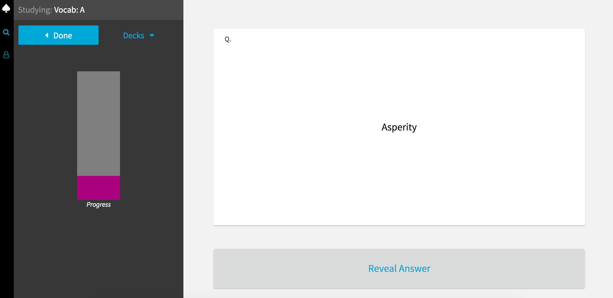
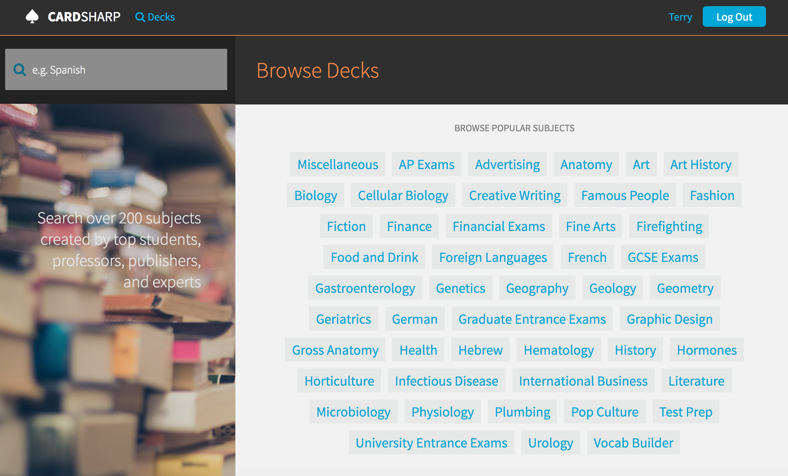

# CardSharp

[See it live.](https://card-sharp.herokuapp.com/)

CardSharp is a full-stack web application inspired by the flash card site Brainscape.
It has a Rails backend with a PostgreSQL database and a React/Redux frontend.

## Features & Implementation

### Decks and Cards
Users must be logged in to create decks and cards, although anyone can search and
inspect them.

Decks enter the database with a `title`, optional `description`, `author_id`, and
`is_private` boolean (defaulting to `false`). Cards are stored with `side_a` and
`side_b` attributes along with a `deck_id`. On creating a deck, users are sent
to that deck's edit page to add, edit, or delete cards.

On the frontend, decks are kept in the `decks` slice of Redux state. When a user
is searching decks by tag, `decks` contains information on the decks with the
searched tag; when a user is looking at his or her profile page, `decks` shows all
the decks made by that user in addition to those made by others that the user has
subscribed to. If a user is editing or studying a deck, more detailed information
is kept in the Redux store's `deckShow`, including the deck's cards.

#### Spotlight: Mastery
Originally, cards were stored with a `mastery` attribute--a number 1 through 5
representing the deck owner's mastery of that card's material, updated every
time the deck owner studied that particular card. When the time came to allow
users to subscribe to and train others' decks, I realized that this model wouldn't
work--a card's mastery would be rewritten every time another user studied it. To
address this, I built a separate Mastery model (with `card_id`, `user_id`, and a
`value` 1 through 5): the deck creator along with subscribed users train on the
same deck with the same cards, but each has a separate mastery item to track
his or her individual progress on the deck.

### Training Mode
This feature is only available to logged-in users. Users choose a deck to study
(it must have cards--empty decks are unavailable for training) and are sent to a
pared-down interface where they can flip between the front and back of cards in
that deck one at a time. A bar on the side keeps track of the user's progress
through the deck and has buttons to switch between decks to study and to return
to the profile page.

#### Spotlight: Training Mode Bugs
In the original iteration of the deck train feature, when users switched from
studying one deck to studying another, the progress shown in the sidebar wouldn't
update. If the switch happened when the last card in the previous deck was showing
its `side_b` (the answer), users would see the same side of the new deck's first
card, even though it should automatically show `side_a`. I solved this by adding
state to the deck train component: when the deck switches, the state is set back
to card 0, prompting a rerender and effectively restarting study progress.

Another small bug: originally, the card item represented in study mode had a
distinct front side and back side; it flipped forward (right) to reveal the answer
on the back and backward (left) to review the question. When a new card replaced
the old, however, users would see a flash of the answer to the new card before it
had finished flipping back to the question side. I solved this by modifying the
flipping mechanism: moving on to the next card doesn't prompt a flip, so the back
of one card is outright replaced by the front of the next card. Maintaining the
front/back, flip-forward-for-answer/ flip-backward-for-question dichotomies would
have been possible, but it was simpler to just dissolve the front-of-card and
back-of-card distinctions and have the card flip forward irrespective of whether
it was switching from the back to the front or vice versa.

### Tags
Tags are stored in the database with just a `name` attribute. The join table
`Taggings` (with `deck_id` and `tag_id` attributes) allows a deck to be associated
with several tags and a tag to be associated with several decks.

Tags are stored on the frontend in the `tags` slice of Redux state. When a particular
tag is searched for, the Redux state's `tagShow` is updated with that tag's `name`
and `id` and `decks` is updated with the decks having that tag.

When users create or edit decks, they can choose to add or remove tags--either
preexisting tags or tags of their own creation.

### Search
The search page initially shows the most popular tags across the site. Users can
then search tags, both CardSharp- and user-created, to find others' decks that
they're interested in studying. From the search interface, they can choose to
subscribe or unsubscribe to those decks. Subscribed decks will then appear on
the user's profile page alongside the decks he or she created. I implemented
the search function's autosuggest through the react-autosuggest NPM package.

## New Directions
With CardSharp, there are many more avenues to explore. My next steps are as
follows:

### Images
Users should be able to upload images to cards in addition to text. I will use
an AWS bucket to store them.

### Badges
Badges will reward users for training regularly, for achieving mastery, and for
creating popular decks.

### Spaced Repetition
I will use the Anki API to implement an optional spaced repetition scheme for
users--CardSharp will calculate the best cards and decks for each user to study
based on their past mastery and the amount of time since last training.

### Friends
Users will be able to list each other as friends and compete with each other to
attain better mastery.
